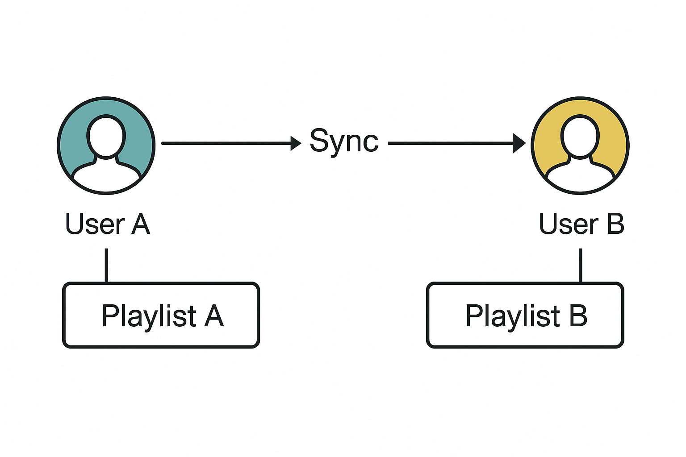

playlist-buddy
Keep two (or more) Jellyfin playlists in perfect, two-way sync across different users.

✨ Features
Works on Jellyfin 10.10.x (uses the classic playlist endpoints)

Handles adds, deletes, and reordering

Fast: tail additions go straight through the Jellyfin API

Safe: bulk deletes or reorders copy the full playlist XML and trigger a single Library.Refresh

Progress-aware: never touches playlists while Jellyfin is actively scanning

Rolling log (1 MB), plus optional full HTTP debug logging

🧠 How It Works
Jellyfin doesn't support real-time shared editing of playlists across users. What playlist-buddy does is:

Watch for changes on a source playlist

Mirror those changes to a destination playlist

Repeat the process in both directions, so both stay in sync

🎯 Fast vs Slow Sync Paths
If you only add items to the end, the tool can sync instantly using Jellyfin’s API (fast path).

If you reorder or delete items, the entire playlist is copied via raw XML and a Library.Refresh is triggered. This is slower — but it’s the only way I could figure out with the current Jellyfin limitations.

This is my best effort solution possible without native Jellyfin support for shared editing, and it works reliably with careful use.

✅ What It Does
Action on source playlist		Result on destination playlist
Add track(s) to the end			Added immediately via API (no refresh)
Delete / Reorder			XML is copied → one Library.Refresh
Simultaneous edits inside 5 sec		The playlist modified last wins (last-writer-wins)

Edits during a library scan		
					< 86% scanned → processed normally
					≥ 86% → queued and applied after scan completes

❌ What It Doesn’t Do
Merge conflicting edits (e.g. add + delete) that happen after the 5-second debounce — the later edit wins.

Handle the new /Playlists/.../Items/Replace endpoint (only in Jellyfin 10.11+).

Sync metadata like images, titles, descriptions, liked/played flags — only the track list is synced.

⚠️ Warnings
This tool is a workaround for a feature Jellyfin doesn’t officially support (as of version 10.10.7).
By default, Jellyfin does not allow multiple users to co-edit a playlist — only the playlist’s owner can make changes.

What playlist-buddy does is act as the guy behind the scenes — it watches for changes and mirrors them between users' playlists.

While it works reliably in my setup, I strongly recommend:

🧪 Test in a safe environment first — with dummy playlists or a test Jellyfin server.

💾 Back up your playlists before trying it on anything important.

⚠️ Understand that playlist data can be lost if something goes wrong.

Use at your own risk — but if you're careful, this tool can save you loads of manual syncing.

🚨 Very Important
I can’t stress this enough:

❗️ DO NOT make changes to synced playlists from multiple devices at the same time.
❗️ If you’re deleting tracks, do it together, on one device, ideally in the same room.

Additions are generally safe — but simultaneous removals or reorders can cause sync issues or data loss due to API delays.

⚡ Quick Start
bash
Copy code
# 1. Python 3.10+ and requests
pip install requests

# 2. Copy the sample config
cp playlist_sync.json.example playlist_sync.json

# 3. Edit playlist_sync.json:
#     – Add your Jellyfin URL and API key
#     – Define source/destination playlist pairs (see notes below)

# 4. Run the script
python playlist_sync.py          # Ctrl-C to stop

# 5. Want wire-level logs?
SET PLAYLIST_SYNC_DEBUG=1        # Windows
export PLAYLIST_SYNC_DEBUG=1     # Linux/macOS
python playlist_sync.py

🔧 Next Steps & Tips

🔑 1. Create an API key
In Jellyfin, go to the Admin Panel → API Keys

Create a new API key for use in playlist_sync.json

📝 2. Create the playlists ahead of time
if you dont already have this prepared, You must create both playlists (on both accounts) and add at least 1 song to it, preferable the same song before running the tool.

You can use the same name for both playlists — Jellyfin automatically handles them in separate folders per user.

The second playlist should appear with a (1) at the end. That’s fine and expected.

⚙️ 3. Configure your sync pairs
In playlist_sync.json, configure each playlist pair like this:

json
Copy code

{
...
  "pairs": [
    { "src": "C:\\ProgramData\\Jellyfin\\Server\\data\\playlists\\EXAMPLE\\playlist.xml",
      "dst": "C:\\ProgramData\\Jellyfin\\Server\\data\\playlists\\EXAMPLE1\\playlist.xml" },
    { "src": "C:\\ProgramData\\Jellyfin\\Server\\data\\playlists\\EXAMPLE1\\playlist.xml",
      "dst": "C:\\ProgramData\\Jellyfin\\Server\\data\\playlists\\EXAMPLE\\playlist.xml" },

    { "src": "C:\\ProgramData\\Jellyfin\\Server\\data\\playlists\\CHANGE ME\\playlist.xml",
      "dst": "C:\\ProgramData\\Jellyfin\\Server\\data\\playlists\\CHANGE ME1\\playlist.xml" },
    { "src": "C:\\ProgramData\\Jellyfin\\Server\\data\\playlists\\CHANGE ME1\\playlist.xml",
      "dst": "C:\\ProgramData\\Jellyfin\\Server\\data\\playlists\\CHANGE ME\\playlist.xml" },
  ]
...
}

You can sync multiple pairs at once. In theory, it should support syncing more than 2 users, but only two-way sync has been tested so far.

🧪 Platform & Compatibility Notes
✅ Tested on Windows 10/11

🐧 Should work on Linux/macOS too (it’s just Python) — but not formally tested

🔁 Only two-way sync between two users is tested

🤔 In theory, you could extend it to support 3+ users — but be careful with edit conflicts
